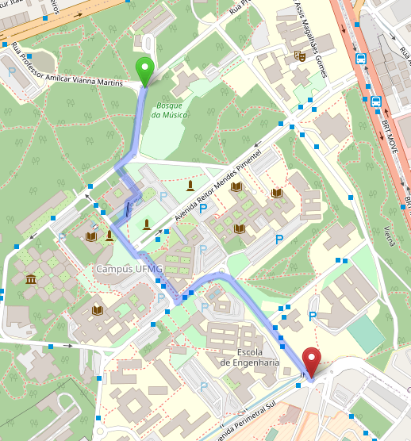
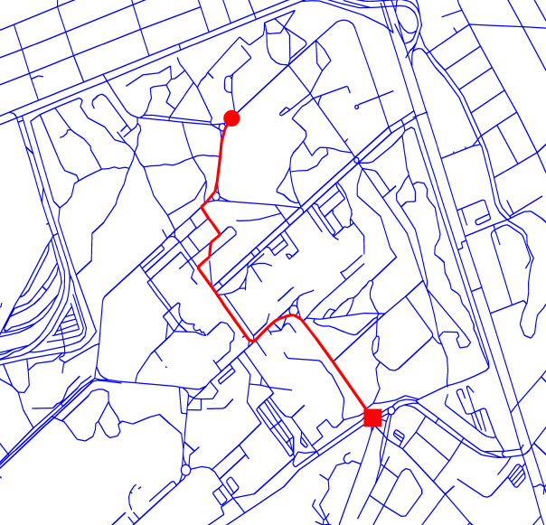

# osm-rs

## Features
- [ ] Interact with OpenStreetMap's APIs
- [ ] Save/Load local `.osm` files.
    -[X] Load
    -[ ] Save
- [X] Filter data by network type
    - [X] Walk
    - [X] Drive
    - [ ] Bike
    - [X] All
- [X] Build graphs from data.
- [ ] Save graphs to `GraphML` file
- [ ] Find shortest-path route by:
    - [X] node_id
    - [ ] coordinates
- [ ] Implement faster shortest path algorithm. (see [Zhan, F. B. (1997) Three Fastest Shortest Path Algorithms on Real Road Networks: Data Structures
and Procedures. Journal of Geographic Information and Decision Analysis, vol.1, no.1, pp. 69-82](https://publish.uwo.ca/~jmalczew/gida_1/Zhan/Zhan.htm))
    - [X] Two-Queues algorithm. 
    - [ ] Double-buckets implementation of Dijkstra algorithm.
- [ ] Visualize network.
    - [X] generate a `.png` picture.

## Examples: 

